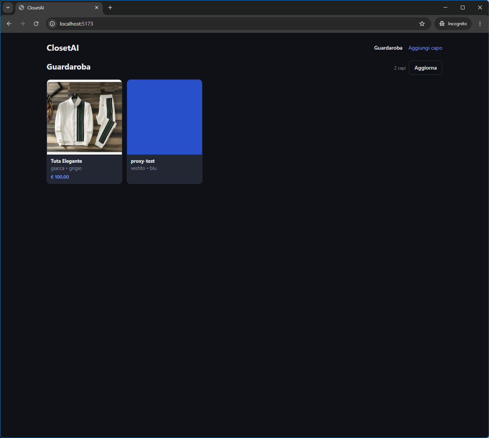
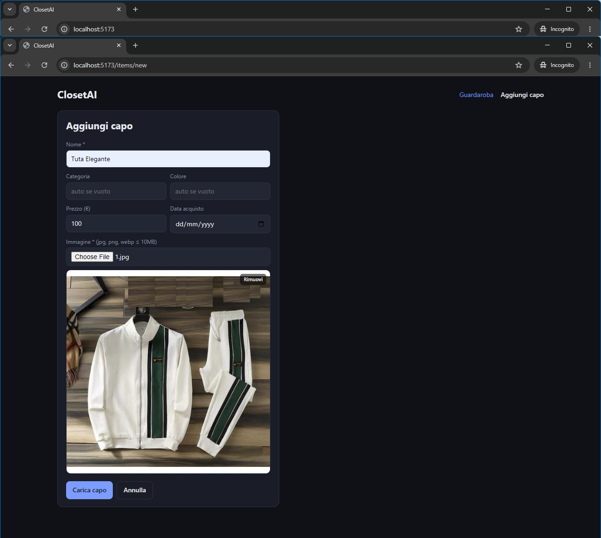
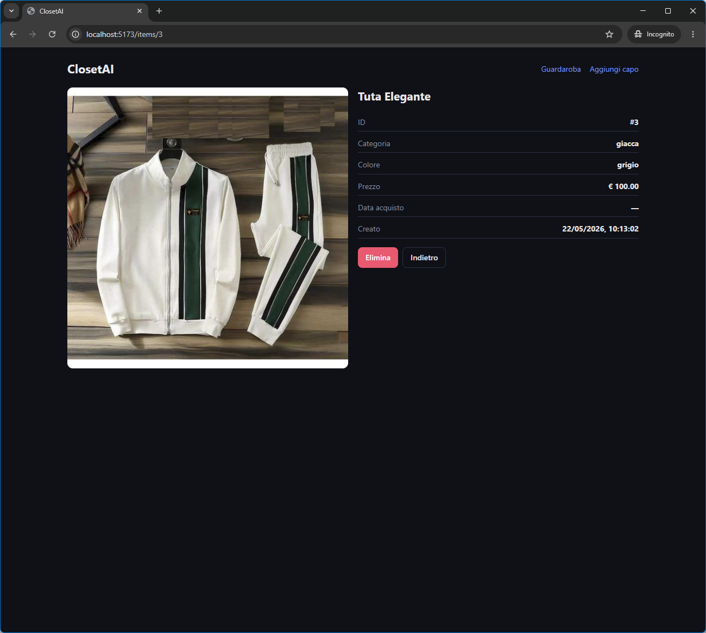

# ClosetAI

Closet AI for green clothing — digitalizza il guardaroba, traccia l'uso reale dei capi e
usa il machine learning per ridurre acquisti impulsivi favorendo riparazione, scambio e rivendita.

Progetto didattico per il corso di **Virtual Worlds** (Master in Informatica per la Salute Digitale,
Università di Pisa). Per la scheda di progetto completa (motivazione, architettura, moduli) vedi
[PROJECT.md](PROJECT.md); per le convenzioni di codice e le istruzioni a Claude vedi
[CLAUDE.md](CLAUDE.md); per la roadmap operativa e lo stato dei task vedi [PLAN.md](PLAN.md);
per il riferimento completo delle API vedi [docs/api.md](docs/api.md).

## Stack

- **Backend**: Python 3.14, FastAPI, SQLAlchemy, SQLite — gestito con [uv](https://docs.astral.sh/uv/)
- **Frontend**: React 19 + Vite 7 + TypeScript
- **ML**: PyTorch + HuggingFace transformers + OpenCLIP (introdotti in Fase 2)

## Struttura del repository

```
closet-ai/
├── backend/      # API FastAPI + servizi + wrapper modelli ML
├── frontend/     # web app React/Vite/TS
├── ml/           # notebook di esplorazione e pesi modelli (gitignored)
├── data/         # storage locale foto e DB (gitignored)
├── docs/         # api.md, screenshots, decisioni tecniche
├── scripts/      # setup e run per macOS/Linux/Windows
├── CLAUDE.md     # istruzioni per Claude Code e convenzioni di progetto
├── PLAN.md       # roadmap e stato dei task
├── PROJECT.md    # scheda di progetto (motivazione, architettura, moduli)
└── README.md     # questo file
```

## Prerequisiti

- **Git**
- **Node.js >= 20** (necessario per il frontend) — https://nodejs.org/
- **uv** verrà installato automaticamente dallo script di setup se mancante
- Python 3.14 viene installato da uv stesso, non serve averlo nel sistema

## Quick start

### macOS / Linux

```bash
git clone <repo-url> closet-ai
cd closet-ai
chmod +x scripts/*.sh
./scripts/setup.sh
./scripts/run-backend.sh        # in un terminale
./scripts/run-frontend.sh       # in un altro terminale
```

### Windows (PowerShell)

```powershell
git clone <repo-url> closet-ai
cd closet-ai
.\scripts\setup.ps1
.\scripts\run-backend.ps1
.\scripts\run-frontend.ps1
```

### Windows (cmd.exe)

```bat
git clone <repo-url> closet-ai
cd closet-ai
scripts\setup.bat
scripts\run-backend.bat
scripts\run-frontend.bat
```

A backend attivo:

- **API**: http://localhost:8000 (riferimento in [docs/api.md](docs/api.md))
- **Swagger UI**: http://localhost:8000/docs
- **ReDoc**: http://localhost:8000/redoc
- **Pagina di test HTML (CRUD via API)**: http://localhost:8000/test/

Il frontend di sviluppo gira su http://localhost:5173 (default Vite); le chiamate `/api/...`
vengono proxy-ate al backend, quindi non servono configurazioni CORS lato sviluppatore.

## Screenshot

> Screenshot live della UI in `docs/screenshots/` — vedere
> [docs/screenshots/README.md](docs/screenshots/README.md) per istruzioni su come
> aggiornarli quando si modifica la UI.

| Guardaroba | Aggiungi capo | Dettaglio capo |
| --- | --- | --- |
|  |  |  |

## Comandi utili

### Backend (dalla cartella `backend/`)

```bash
uv sync                              # installa/aggiorna le dipendenze
uv add <pkg>                         # aggiunge una dipendenza runtime
uv add --dev <pkg>                   # aggiunge una dipendenza di sviluppo
uv run uvicorn app.main:app --reload # avvio manuale del backend in dev
uv run pytest                        # esegue tutta la suite di test
uv run pytest -v                     # output verboso
uv run pytest tests/test_items.py    # solo un file
uv run ruff check app/ tests/        # lint
```

### Frontend (dalla cartella `frontend/`)

```bash
npm install                          # installa le dipendenze
npm run dev                          # dev server con hot-reload su :5173
npm run build                        # build di produzione in dist/
npm run preview                      # preview locale del build
npm run typecheck                    # controllo dei tipi TS (no emit)
```

### Variabili d'ambiente

- **Backend** — `CLOSETAI_DATA_DIR`, `CLOSETAI_DB_PATH`, `CLOSETAI_DATABASE_URL`
  (vedi [docs/api.md](docs/api.md)).
- **Frontend** — `VITE_API_BASE_URL` (vedi [frontend/.env.example](frontend/.env.example)).

## Materiali per l’esame ufficiale

- **Presentazione**: [docs/ClosetAI-esame-ufficiale.pptx](docs/ClosetAI-esame-ufficiale.pptx) —
  16 slide in italiano, con commento orale incorporato in ogni slide. Distingue
  esplicitamente modelli nostri, pre-addestrati, generativi e regole.
- **Guida orale**: [docs/exam-oral-guide.md](docs/exam-oral-guide.md) — risposte
  sui capi fantasma, numeri difendibili, domande probabili e roadmap mobile.
- **Notebook ML**: [ml/notebooks/exam/](ml/notebooks/exam/) — cinque notebook
  autosufficienti ed eseguiti: due modelli caricati dal prodotto e tre
  esperimenti accademici chiaramente separati.

Per rigenerare la struttura dei notebook:

```bash
cd backend
uv run python scripts/build_exam_notebooks.py
```

I file storici `docs/presentation.pptx` e `ml/notebooks/closetai_ml.ipynb`
restano come archivio pre-esame e non sono i materiali da proiettare.

## Modello di diagnosi stato (rete addestrata da noi)

Una rete neurale (MLP su embedding Fashion-CLIP) che dalla **foto** prevede
lo stato di conservazione del capo. Workflow completo:

```bash
cd backend
uv run python scripts/fetch_real_garments.py --count 240    # scarica capi reali (FashionMNIST)
uv run python scripts/build_condition_dataset.py --per-class 150  # genera dataset etichettato
uv run python scripts/train_condition_model.py --no-cache   # addestra + valuta + salva i pesi
```

I pesi salvati (`ml/weights/condition_head.pt`) vengono caricati
automaticamente dal backend, che sostituisce l'euristica con la rete.
Dettagli in [docs/architecture.md](docs/architecture.md) (ADR-009) e nella
[datasheet del dataset](docs/dataset-datasheet.md).

## Gap analysis del guardaroba (rete neurale tabellare)

Una seconda rete neurale addestrata da noi che, dai **dati aggregati** del
guardaroba (non dalle foto), individua i **vuoti funzionali** ("manca una
giacca", "troppe t-shirt") e suggerisce acquisti consapevoli —
*Fashion-CLIP riconosce i capi, questa rete trova i vuoti*.

```bash
cd backend
uv run python scripts/build_wardrobe_dataset.py --rows 5000   # dataset tabellare
uv run python scripts/train_gap_model.py                      # addestra l'MLP multi-label
```

I pesi (`ml/weights/gap_model.pt`) alimentano `GET /stats/gap-analysis` e la
card "🧩 Analisi guardaroba" nella dashboard. Senza pesi, il backend usa le
regole esperte (fallback). Dettagli in [docs/architecture.md](docs/architecture.md) (ADR-011).

## Stato

Vedi [PLAN.md](PLAN.md) per lo stato dei task e la roadmap completa.

## Licenza

Vedi [LICENSE](LICENSE).
